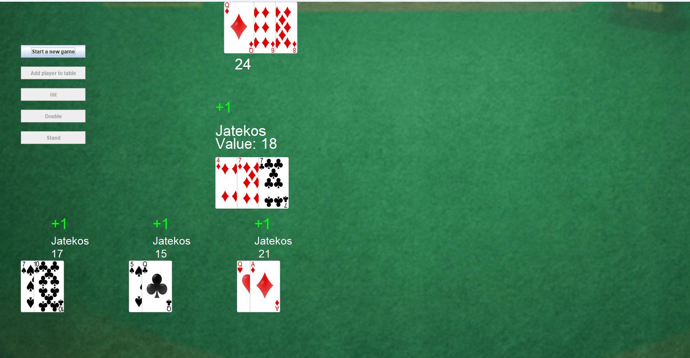
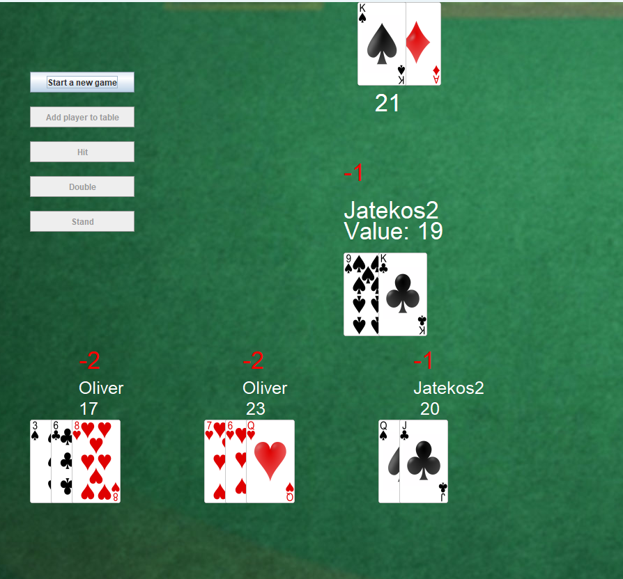
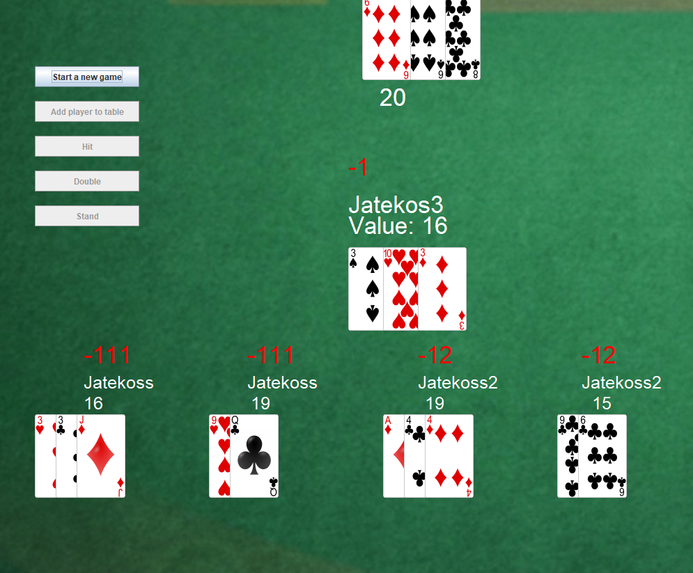

# Multiplayer Blackjack

Ez egy egyszerű, egygépes, többjátékos Blackjack játék Java nyelven, Swing grafikus felülettel.

## Funkciók

- Több játékos támogatása ugyanazon a gépen.
- Kártyák véletlenszerű kiosztása.
- Klasszikus Blackjack szabályok:
  - **Hit** (új lap kérése)
  - **Stand** (megállás)
  - **Double** (duplázás: egyszeri lap húzás és a tét duplázása)
- Egyszerű kezelőfelület Swing segítségével.
- Az osztó (dealer) automatikusan játszik a szabályok szerint.
- Játékosok egymás után következnek.

## Játék menete

1. A játékosok megadják a nevüket a játék elején.
2. Minden játékos két lapot kap.
3. Sorban minden játékos dönthet:
   - **Hit**: Új lapot kér.
   - **Stand**: Megáll az aktuális pontszámánál.
   - **Double**: Megduplázza a tétjét, kap még egy lapot, majd automatikusan megáll.
4. Miután minden játékos befejezte a körét, az osztó húz lapokat a szabályok szerint (általában 17-nél megáll).
5. A játék eredménye kiszámításra kerül:
   - Aki nem lépte túl a 21-et, és közelebb van hozzá, mint az osztó, az nyer.
   - Aki túllépte a 21-et, automatikusan veszít (Bust).
   - Ha a pontszámok egyenlőek az osztóval, döntetlen.

## Használt technológiák

- **Java SE**
- **Swing** (GUI komponensekhez)

## Indítás

1. Fordítsd le a projektet (`javac`) vagy használd IDE-t (pl. IntelliJ, Eclipse).
2. Futtasd az alkalmazást (`java Main`).

## További megjegyzések

- A jelenlegi verzióban minden játékos egy körönként egymás után játszik ugyanazon az eszközön.
- A Double funkció csak a játékos első két lapja után érhető el, a szabályoknak megfelelően.
- A játék grafikai felülete egyszerű, de jól követhető.

## Képek a játékról

